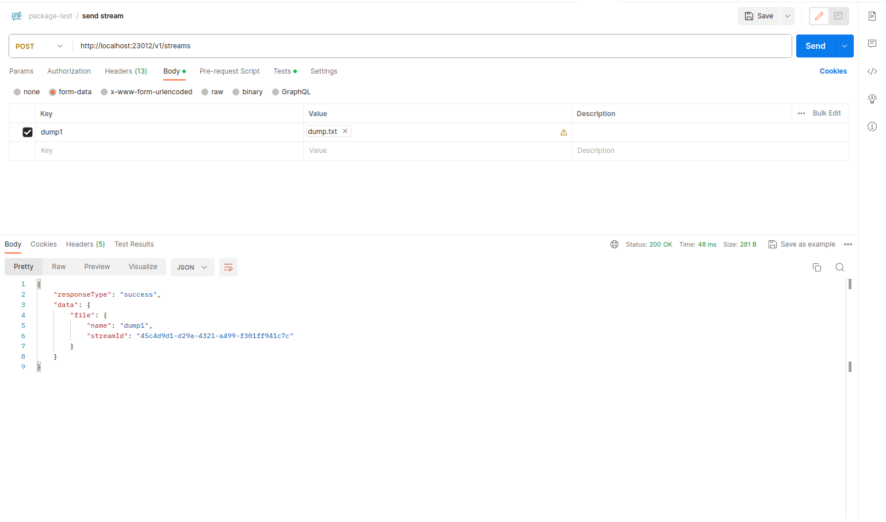
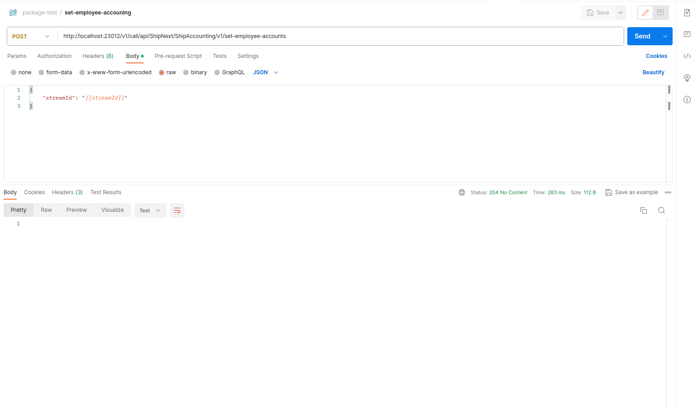
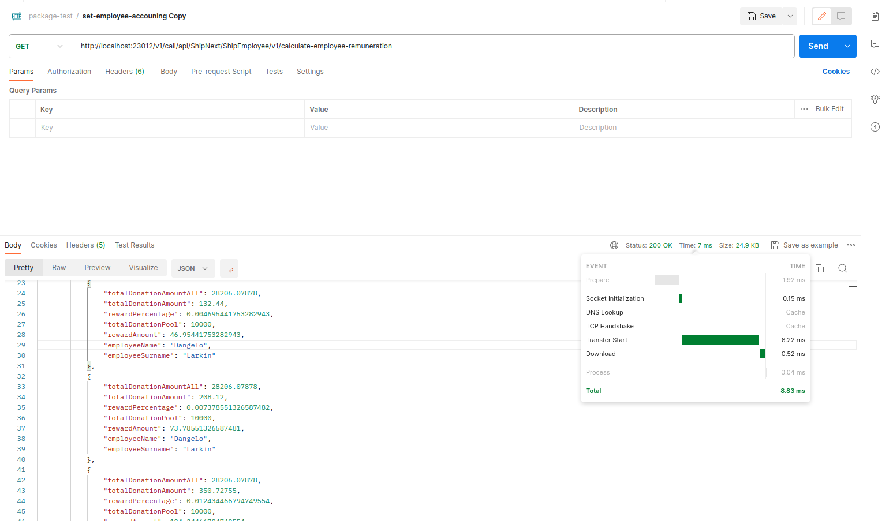

# NextShip тестове завдання

Завдання в собі включає архітектурні рішення, а також реалізації безпосередніх тестових задач

## Зміст
- [Зміст тестового завдання](#зміст-тестового-завдання)
- [Запуск застосунку](#запуск-застосунку)
- [Архітектура застосунку](#архітектура-застосунку)
- [Концепції](#концепції)
- [Результати вирішення задач](#результати-вирішення-задач)

## Зміст тестового завдання

### Завдання 1

Завдання: імпортувати файл дампа в БД.

###Формат файлу

Формат звичайного тексту, що представляє об’єкти з властивостями та іншими вкладеними об’єктами
об'єктів. Ієрархія визначається відступами (кожен рівень 2 проміжки).
Тип кожного об'єкта називається з великої літери, властивості - з а
маленька літера. Файл містить список співробітників (Employee), кожен з основними
властивості (ім'я, прізвище, ідентифікатор). Крім того, кожен співробітник належить до деяких
відділу (Відділу) і має розписку посадових окладів (Відомість) за рік.
Зарплата визначається датою і сумою (завжди в доларах США). Працівник може
також є записи про благодійні внески (пожертви), внески
сума може бути в будь-якій валюті. Крім того, файл містить обмін
курси (Rate) для всіх пар дата-валюта, які зустрічалися в
внески. Досить зберігати еквівалент внесків у доларах США
в базі даних.
Файл дампа додається.

### Завдання 2 (запит)

Мета: створити кінцеву точку API, яка виконує такі обчислення
в БД і повертає результати. Необхідно виконати всі розрахунки
в одному запиті SQL.

Для співробітників, які пожертвували понад 100 доларів на благодійність, розрахуйте одноразово
винагорода, еквівалентна їх внеску з пулу в 10 000 доларів США.
Наприклад, якщо працівник надіслав 200 доларів США із загальної суми 1000 доларів США,
він/вона має отримати 20% від 10 000 доларів США.
Якщо внески працівника становлять менше 100 доларів США, вартість слід врахувати
до загальної суми, але працівник не отримує винагороди.

### Питання

Мета: продемонструвати, що прийняті вами дизайнерські рішення були надійними
відповідаючи на питання.

1. Як змінити код для підтримки різних версій файлів?
2. Як зміниться система імпорту, якщо зникнуть дані про курси валют
   файл, і його потрібно буде отримати асинхронно (через API)?
3. У майбутньому клієнт може забажати імпортувати файли через веб-інтерфейс,
   як можна змінити систему, щоб це дозволило?

## Запуск застосунку

1. В директорії `configs` в файлі `api.dev.config.json` змінити значення змінної `business-schema-path` на абсолютний шлях до вхідної точки в схему застосунків.
2. Встановити `Docker` та розгорнути базу даних `MongoDB`.
3. Запустити сервер.
4. Викликати маршрут `http://localhost:23012/v1/streams` (базовий маршрут за замовчуванням є таким, за бажанням може бути змінений), та передати файл дампту. Файл знаходиться в директорії `seeds`. При передачі використовувати `form-data`. В результаті буде отриманий ідентифікатор стріму (тимчасового буферу, який зберігається в пам'яті 1 хв).
5. Викликати маршрут `http://localhost:23012/v1/call/api/ShipNext/ShipAccounting/v1/set-employee-accounts` та передати `streamId` - в базу даних буде записана вся інформації з файлу.
6. Викликати маршрут `http://localhost:23012/v1/call/api/ShipNext/ShipEmployee/v1/calculate-employee-remuneration` -  та отримати необхідні обчислення по винагородам працівників.

Деталі зі скринштомати прикладуються в рзоділі [Результати вирішення задач](#результати-вирішення-задач)

## Архітектура застосунку

Сервер складається з двух частин:
- Ядро - агрегує в собі системний код, який може бути використаний в будь-якому веб-застосунку.
- Схема застосунку - агрегує в собі прикладний код, який використовується лише конкретним застосунком.

Ядро складається з:
- `Connectors` - Кожен коннектор реалізовує з'єднання з іншим системним блоком, таким як база даних, inMemory сховище, таке як Radis, сервер обробки черг та ін. Ці елементи відповідають за системне обчислення але можуть знаходитись в різних мережах та на різних машинах. 
- `Services` - Сервіси мають лише один екземпляр в рамках роботи програми, та призначення для надання функіоналу роботи як ядра так і схем.
- `Providers` - Провайдери мають Transient формат ініціалізації, щоб не мати текучки пам'яті. Провайдери реалізовують як stateless прості функції, так і надають API по роботі з окремим системним блоком, таким як база данних, inMemory сховище і т.д.
- `Ioc` - Контейнер інверсії залежностей. Сервер побудований таким чином, що окремі модулі не залежать від інших напряму, а залежать від будь-якої реалізації які описують потрібний інтерфейс. Кожна реалізація поміщається в контейнер з якого відбувається інверсія залежностей.
- `loaders` - Завантажувачі призначення для завантаження та перетворення в абстрактні схеми., наразі є схема застосунків, в подальшому можуть бути схеми документації, схеми специфікації і т.д. Схеми в подальшому паряться відповідним адаптерами `adapters`, конкретної технології, будь-то відповідний фреймворк чи ін.  
- `agents` - Агенти надають функціонал ядра - бізнес-схемі.
- `adapters` - Адаптери перекладають абстрактні схеми до конкретного формату, який реалізовує та чи інша технологія така як фреймворк чи ін. 
- `factories` - Фабрики призначені для відбору конкретного адаптера, який зазначений в конфігурації того чи іншого ядра.
- `abstract-documents` - Абстрактні документи призначення для декларативного контролю реалізації схем. Фактично створюють обмеження та задають правила реалізації схеми застосунків.

Схема застосунку складається з:
- `application-list` -вхідна точка, яка реєструє в собі той чи інший застосунок (або сервіс, якщо реалізований з'єднувач до серверу обробки черги та кожний сервіс має API між собою через сервер обробки черг).
- `application` - вхідна точка конкретного застосунку, реєструє колекції в схемі застосунків.
- `collection` - вхідна точка конкретної колекції. Колекція це окрема сутність за парадигмою DDD. Колекція може бути як окремим доменом, так і агрегатом доменів.
- `document` - конкретний документ, який відповідає за одну задачу в рамках однієї колекції.

Типи документів:
- `application-list` - документ, який призначений для опису та реєстрації списку застосунків.
- `application` - документи, який призначений для опису та реєстрації застосунку.
- `collector` - документ реєстратор всіх документів конкретної колекції.
- `router` - документ - маршрутизатор, який описує всі маршрути відповідної колекції.
- `controller` - документ - композитор, який реалізовує обробник відповідного маршруту
- `helpers` - документ, який описує логіку, яка не зв'язана з базою даних.
- `mongo-schema` - документ, який описує таблицю в базі даних `MongoDB`.
- `mongo-repository` - документ, який містить всі запити до конкретної колекції бази даних `MongoDB`. 

## Концепції


## Результати вирішення задач

### Завдання 1

- Ядро сервера має окремий єндпоїнт `/v1/streams` через, який необхідно завантажувати файли на сервер. 
  - З урахуванням конфігурації файл тимчасово зберігається в необхідному варіанта - в пам'яті, в тимчасову файлі і т.д.
  - Файл підтримує обробку декількох файлів.
  - Це необхідно для препроцессінга, в подальшому перевірки прав доступу, перевірки ліміту чи кількості запитів від тієї чи іншої сессії, обмеження в рамках конкретної сессії і т.д



- Після чого необхідно здійснити запит до `/v1/call/api/ShipNext/ShipAccounting/v1/set-employee-accounts` та передати унікальний ідентифікатор streamId - тимчасового файлу.



### Завдання 

Необхідно здійснити виклик маршруту `/v1/call/api/ShipNext/ShipEmployee/v1/calculate-employee-remuneration`. Результатом виконання є массив об'єктів:
```json5
{
  "status": "success",
  "data": {
    "remunerations": [
      {
        "totalDonationAmountAll": 28206.07878,
        "totalDonationAmount": 310.52318,
        "rewardPercentage": 0.011009087169542395,
        "totalDonationPool": 10000,
        "rewardAmount": 110.09087169542394,
        "employeeName": "Jensen",
        "employeeSurname": "Wuckert"
      },
      {
        "totalDonationAmountAll": 28206.07878,
        "totalDonationAmount": 242.88144,
        "rewardPercentage": 0.008610960846220823,
        "totalDonationPool": 10000,
        "rewardAmount": 86.10960846220823,
        "employeeName": "Dangelo",
        "employeeSurname": "Larkin"
      },
      {
        "totalDonationAmountAll": 28206.07878,
        "totalDonationAmount": 132.44,
        "rewardPercentage": 0.004695441753282943,
        "totalDonationPool": 10000,
        "rewardAmount": 46.95441753282943,
        "employeeName": "Dangelo",
        "employeeSurname": "Larkin"
      },
      {
        "totalDonationAmountAll": 28206.07878,
        "totalDonationAmount": 208.12,
        "rewardPercentage": 0.007378551326587482,
        "totalDonationPool": 10000,
        "rewardAmount": 73.78551326587481,
        "employeeName": "Dangelo",
        "employeeSurname": "Larkin"
      },
      // ...
    ]
  }
}
```
де:
- `totalDonationAmountAll` - суммарні пожертувавання співробітниками.
- `totalDonationAmount` - сума пожертувавнь конкретним співробітником.
- `rewardPercentage` - відсоток пожертувавнь конкретним працівником відносно `totalDonationAmountAll`
- `totalDonationPool` - загальний пул виногороди.
- `rewardAmount` - винагорода конкретного співпрацівника.
- `employeeName` - ім'я працівника.
- `employeeSurname` - прізвище працівника.




### Відповіді на запитання

1. Як змінити код для підтримки різних версій файлів?
    Ядро сервера не зміниться ніяк не зміниться. В Схемі застосунків в залежності від бізнес-вимог будуть наступні сценарії:
   - в системі в колекції "ShipAccounting" буде замінений обробник маршруту в документі Controller, в разі зміни структури бази даних, додатково пишеться міграція бази даних.
   - Створення нового маршруту з новою версією (ядро сервера вимагається вказувати версію маршруту), та в документі helpers відповідної категорії написаний метод `transform`, який переводить з старого формату (для підтримки версії v1 в новий формат).

2. Як зміниться система імпорту, якщо зникнуть дані про курси валют файл, і його потрібно буде отримати асинхронно (через API)?
    - В `helpers` колекції `ShipAccounting` потрібно створити додаткову перевірку при `Split` файлу по ключовому слову `Rates`. Якщо елемент один (за відсутності `Rates`) - необхідно викликати додатковий helper -  `getRatesForHTTP`, в якому відбувається асихнронний запит до відповідної інтеграції.
В подальшому, в залежності від бізнес-вимог, потрібно зберігати курс або в базі даних або в кеш сервісі, або здійснювати постійно запит до інтеграції - власника інформації.
3. В майбутньому клієнт може забажати імпортувати файли через веб-інтерфейс, як можна змінити систему, щоб це дозволило?
    - Ніяк, логіка побудова с самого початку таким чином, щоб файл завантажувався через API.

